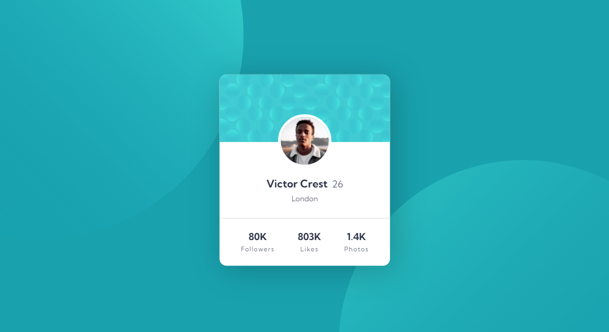

# Frontend Mentor - Profile card component solution

This is a solution to the [Profile card component challenge on Frontend Mentor](https://www.frontendmentor.io/challenges/profile-card-component-cfArpWshJ). Frontend Mentor challenges help you improve your coding skills by building realistic projects.

[Solution][solution-url] . [Live Page][live-page]

Table of contents

-   [Overview](#overview)
    -   [The challenge](#the-challenge)
    -   [Screenshot](#screenshot)
    -   [Links](#links)
-   [My process](#my-process)
    -   [Built with](#built-with)
    -   [What I learned](#what-i-learned)
-   [Author](#author)

## Overview

### The challenge

Users should be able to:

- See hover states for interactive elements

### Screenshot

 

### Links

-   [Solution][solution-url]
-   [Live Page][live-page]

## My process

### Built with

- Semantic HTML5 markup
- CSS custom properties
- FlexBox layout
- Mobile-first workflow

(<a href="#top">back to top</a>)

### What I learned

This challenge was a great learning opportunity, it was also very useful to reinforce previous knowledge, and face problems that had not been presented to me before.

(<a href="#top">back to top</a>)

## Author

-   Instagram - [@cosmo_art0](https://www.instagram.com/cosmo_art0/)
-   Frontend Mentor - [@CosmoArt](https://www.frontendmentor.io/profile/cosmoart)
-   Twitter - [@CosmoArt0](https://twitter.com/cosmoart0)

(<a href="#top">back to top</a>)

[live-page]: https://cosmoart.github.io/profile-card-solution/
[solution-url]: https://www.frontendmentor.io/solutions/profile-card-component-solution-5WHFWVJN9
